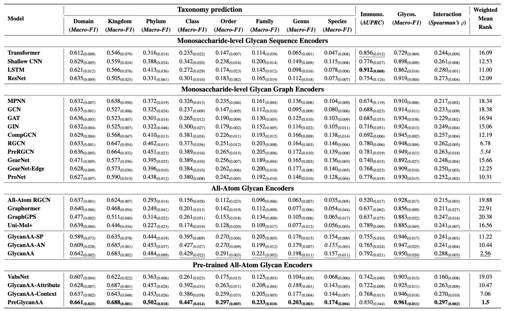

# GlycanAA: Modeling All-Atom Glycan Structures via Hierarchical Message Passing and Multi-Scale Pre-training

This is the official codebase of the paper [Modeling All-Atom Glycan Structures via Hierarchical Message Passing and Multi-Scale Pre-training](arxiv:link), accepted by **ICML 2025** ([Openreview link](https://openreview.net/forum?id=fbmj0EoeFk)).

[Minghao Xu](https://chrisallenming.github.io/),  [Jiaze Song](https://kasawa1234.github.io), Keming Wu, Xiangxin Zhou, [Bin Cui](https://cuibinpku.github.io/), [Wentao Zhang](https://zwt233.github.io/)

## Overview

We present **GlycanAA**, an all-atom glycan modeling framework that represents glycans as heterogeneous graphs, capturing both **monosaccharide-level backbones** and **atomic-level structures** through **hierarchical message passing**. We further pre-train it with **multi-scale mask prediction**, yielding **PreGlycanAA**, a self-supervised model that learns diverse glycan dependencies. **GlycanAA** and **PreGlycanAA** outperform existing atomic-level and glycan-specific encoders on the GlycanML benchmark, ranking **first** and **second**. Ablation studies confirm the benefits of hierarchical message passing and multi-scale pre-training.



This codebase is based on PyTorch and [TorchDrug](https://torchdrug.ai/), a powerful and flexible machine learning platform for drug modeling. It supports training and inference with multiple GPUs or multiple machines.

## Installation ##

You may install the dependencies of GlycanAA as below. 
Generally, they work with Python 3.8/3.9 and PyTorch version >= 1.8.0.

```bash
conda create -n torchdrug python=3.9
conda activate torchdrug

conda install --yes pytorch==1.12.1 torchvision==0.13.1 torchaudio==0.12.1 cudatoolkit=11.3 -c pytorch
conda install --yes pyg pytorch-scatter pytorch-cluster -c pyg
pip install torchdrug
pip install pyyaml easydict scipy fair-esm
pip install dill biopandas biopython e3nn wandb tensorboard tensorboardX
pip install glycowork[draw]
pip install glyles
```

## Model Training ##

### Experimental Configurations

We provide a yaml based config for experiments in our paper. The configs are stored in `./config/` with the following folder structure:

```
config
 └── single_task
     ├── GlycanAA
     ├── GlycanAA-AN
     ├── GlycanAA-WP
     ├── AA-RGCN
     ├── GearNet
     ├── GearNet-Edge
     ├── ProNet
 ├── pretrain
     ├── GlycanAA
     ├── Context
     ├── GlycanRGCN
     ├── VabsNet
 ├── downstream
     ├── GlycanAA
     ├── GlycanRGCN
     ├── VabsNet
```

To save space, in each category (*i.e.* 'single_task', 'pretrain' or 'downstream'), only **GlycanAA** provides the complete set of configuration files, while other models only include the `species.yaml` file. For task-specific configurations, please refer to the corresponding config files under the same category in **GlycanAA**.

### Launch Experiments

**Single-GPU.** By setting gpus: `[0]`, the experiment is performed under a single GPU. 
You can use the following command to run with seed 0:

```
python scripts/run_single.py --config ./configs/single_task/GlycanAA/species.yaml \
    --gpus [0] --seed 0
```

**Multi-GPU.** By setting gpus: `[0,1,2,3]`, the experiment is performed under 4 GPUs of a node. 
You can use the following command to run with seed 0:

```
python -m torch.distributed.launch --nproc_per_node=4 scripts/run_single.py \
    --config ./configs/single_task/GlycanAA/species.yaml --gpus [0,1,2,3] --seed 0
```

## License

This codebase is released under the Apache License 2.0 as in the [LICENSE](https://github.com/kasawa1234/GlycanAA/blob/main/LICENSE) file.

## Citation

If you find this codebase helpful in your research, please cite the following paper.

```
@article{xu2024glycanaa,
  title={Modeling All-Atom Glycan Structures via Hierarchical Message Passing and Multi-Scale Pre-training}, 
  author={Minghao Xu and Jiaze Song and Keming Wu and Xiangxin Zhou and Bin Cui and Wentao Zhang},
  journal={arXiv preprint arXiv:2506.01376},
  year={2025}
}
```
